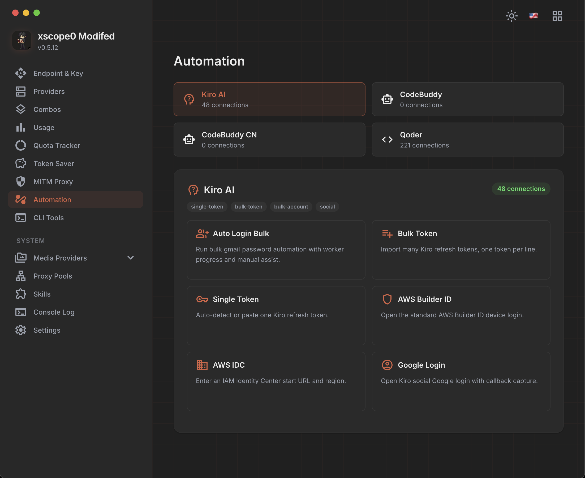

<p align="center">
  
</p>

<h1 align="center">xscope0 Router</h1>

<p align="center">
  AI API proxy engine with provider failover, token compression, and circuit breaking.<br>
  Sits between your CLI tool and AI providers. Translates formats, rotates accounts, compresses tokens.<br>
  No telemetry. No external servers. Everything runs locally.
</p>

<p align="center">
  <a href="https://github.com/xscope0/xScope0-Router/releases/latest"></a>
  <a href="https://github.com/xscope0/xScope0-Router/blob/main/LICENSE"></a>
  <a href="https://github.com/xscope0/xScope0-Router/pulls"></a>
  
  <a href="https://github.com/xscope0/xScope0-Router/stargazers"></a>
  <a href="https://github.com/xscope0/xScope0-Router/network/members"></a>
  <a href="https://github.com/xscope0/xScope0-Router/issues"></a>
  
</p>

<p align="center">
  <a href="#quick-start"></a>
  <a href="#how-it-works"></a>
  <a href="#providers"></a>
  <a href="#features"></a>
  <a href="#build"></a>
</p>

<p align="center">
  <a href="docs/id.md">🇮🇩 Bahasa Indonesia</a> · <a href="docs/vi.md">🇻🇳 Tiếng Việt</a> · <a href="docs/zh.md">🇨🇳 中文</a> · <a href="docs/ja.md">🇯🇵 日本語</a> · <a href="docs/ru.md">🇷🇺 Русский</a>
</p>

---

<div align="center">
  
  
</div>

---

## Quick Start

```bash
npm install -g xscope0-modifed-router
xscope0-router
```

Or run directly:

```bash
npx xscope0-modifed-router
```

| Endpoint | URL |
|----------|-----|
| **Dashboard** | `http://localhost:20128/dashboard` |
| **API** | `http://localhost:20128/v1` |
| **Health** | `http://localhost:20128/health` |

---

## How It Works

```
┌─────────────────┐
│    Your CLI     │  Claude Code, Codex, Cursor, Cline, OpenCode...
│      Tool       │
└────────┬────────┘
         │ POST http://localhost:20128/v1/chat/completions
         ↓
┌─────────────────────────────────────────────────────────────┐
│                     VansRoute Engine                        │
│                                                             │
│   1. Auth & ACL check          (cached API key validation)  │
│   2. Circuit Breaker           (skip dead proxy buckets)    │
│   3. Account Semaphore         (queue if at concurrency cap)│
│   4. Token Compression         (RTK / Caveman / Ponytail)   │
│   5. Format Translation        (OpenAI ↔ Claude ↔ Gemini)   │
│   6. Param Stripping           (Kimchi CLI-aligned)         │
│   7. Executor                  (upstream via proxy if set)  │
│   8. Response Translation      (back to client format)      │
│                                                             │
│   On success: clearProviderFailure() + clearAccountError    │
│   On error:   recordProviderFailure() → breaker counts      │
│               markAccountUnavailable() → try next account   │
│               Kimchi quota? → deactivate until month end    │
└─────────────────────────────────────────────────────────────┘
         │
         ├─→ Kimchi              (5 CLI models, quota auto-reactivation)
         ├─→ AgentRouter         ($200 free credits, passthrough)
         ├─→ GitHub Copilot      (subscription tier)
         ├─→ Gemini / OpenCode   (free tier)
         ├─→ OpenRouter / NVIDIA (pay-per-token)
         └─→ Combo               (fallback / round-robin / fusion / capacity)
```

---

## Providers

| Provider | Auth | Models | Notes |
|----------|------|--------|-------|
| **Kimchi** | OAuth | 5 CLI models | Quota auto-reactivation at month end |
| **AgentRouter** | API key | All | $200 free credits, direct passthrough |
| **GitHub Copilot** | OAuth | Copilot models | Subscription tier |
| **Gemini CLI** | OAuth | Gemini family | Free tier |
| **OpenCode** | OAuth | Multiple | Free tier |
| **OpenRouter** | API key | 100+ models | Pay-per-token |
| **NVIDIA** | API key | NIM endpoints | Pay-per-token |
| **Combo** | — | Aggregated | Fallback / round-robin / fusion / capacity |

---

## Features

**Routing Engine**
- Circuit breaker per provider bucket (auto-skip dead pools)
- Account semaphore (concurrency cap per provider)
- Format translation between OpenAI / Claude / Gemini / Kiro protocols
- Kimchi CLI-aligned parameter stripping
- Proxy pool support (HTTP/SOCKS5, auto-rotate on errors)

**Token Management**
- RTK compression (request token kiln)
- Caveman mode (ultra-compressed prompts)
- Ponytail mode (minimal output)
- Visible request logs for Caveman / Ponytail in dashboard

**Account Pool**
- Bulk import API keys (appends, never replaces)
- Bulk delete selected / inactive / deactivated
- Provider-wide `Error → inactive` policy
- Proxy force-delete unbinds accounts first
- Kiro temporary suspension handling

**xscope0 Build**
- Custom branding and provider icons
- Pi provider endpoint: `http://localhost:20128/v1`
- Donate / Remote UI removed

---

## Architecture

```
xScope0-Router/
├── cli.js                   # Entry, process mgmt, system tray
├── src/cli/                 # Core engine modules
├── app/
│   ├── server.js            # Express API server
│   ├── custom-server.js     # HTTP server setup
│   └── next.config.mjs      # Dashboard (Next.js)
├── hooks/
│   ├── postinstall.js       # Runtime dep installation
│   ├── sqliteRuntime.js     # SQLite native modules
│   └── trayRuntime.js       # System tray binary
├── scripts/
│   └── build-cli.js         # esbuild bundler
├── assets/
│   ├── logo.png
│   └── preview/
└── package.json
```

---

## Build

```bash
git clone https://github.com/xscope0/xScope0-Router.git
cd xScope0-Router
npm install
npm run build
npm pack
```

**Requirements:** Node.js >= 18.0.0

**Runtime deps** (auto-installed by `postinstall.js`):
- `sql.js` / `better-sqlite3` → `~/.9router/runtime/node_modules`
- `systray2` (macOS/Linux only) → `~/.9router/runtime/node_modules`

---

## License

MIT — Original project: [9router](https://github.com/decolua/9router)

---

<p align="center">
  
  
  
  
  
</p>

<p align="center">
  <sub>Built by <a href="https://github.com/xscope0">xscope0</a></sub>
</p>
